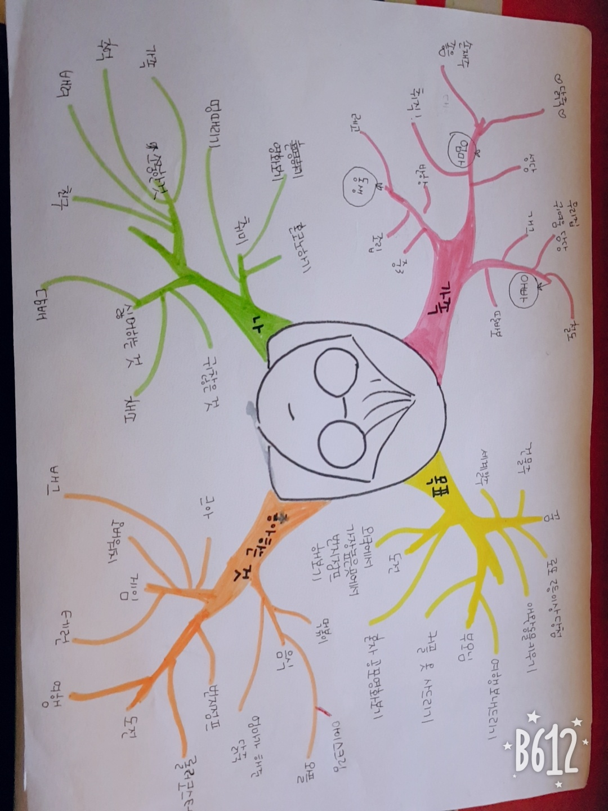

#자기소개 마인드맵
### 컴퓨터과학부 2018920010 김수현

* **가족**
  * 아빠
    * 철도
    * 우리집 귀여움 담당
    * 개그
    * 딸바보
  * 엄마
    * 성당
    * 닭죽
    * 손재주 좋음
    * 취직
  * 동생
    * 반항
    * 중3
    * 조립
    * 레고
* **나**
  * 취미
     * 혼코노하기
     * 영화보기
     * 멍때리기
  * 소중한것
     * 가족
     * 추억
     * 배려
     * 친구
  * 싫어하는것
     * 귀찮은 것
     * 채소
     * 담배
* **목표**
  * 꿈
    * 건물주
    * 세계일주
    * 로또 2등이상 당첨
    * 애완동물 키우기
  * 부모님
    * 여행보내드리기
    * 커플 옷 사드리기
  * 도전
    * 세계에서 가장 높은 곳에서 번지점프 하기
    * 혼자 공포영화 보기
* **좋아하는 것**
  * 음식
    * 떡볶이
    * 와플
    * 엄마가 해준 닭죽
    * 아이스크림
  * 도전
    * 번지점프
    * 롤러코스터
    * 여행
  * 게임
    * 테일즈러너
    * 오버워치
    * 배틀그라운드
    * 크아
